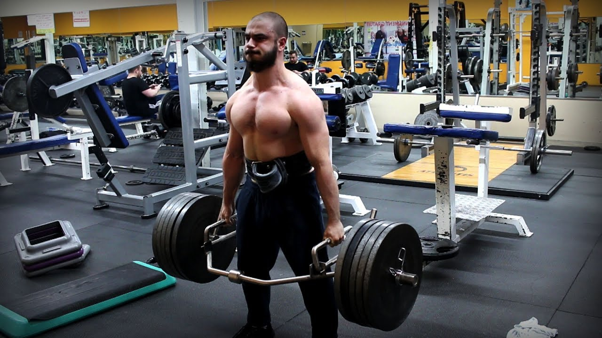
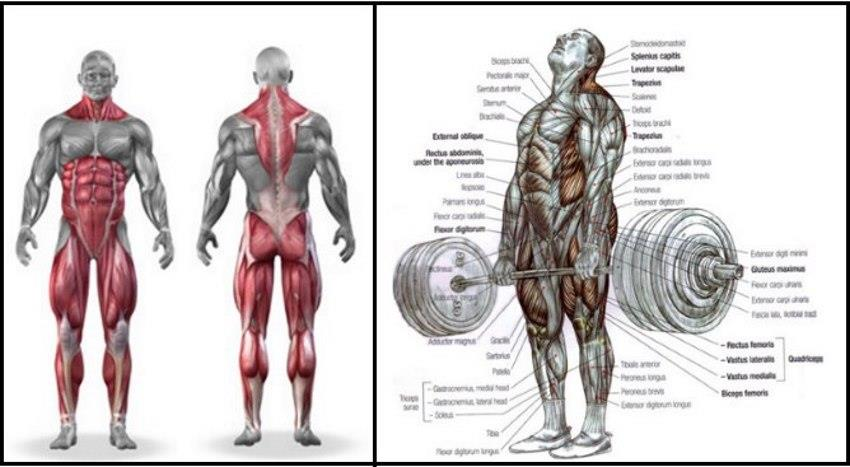

*In this article, you'll discover the different variations of deadlift and why Trap Bar Deadlifts might be the best.*

---

### What is deadlift

Deadlift is one of the three main lifting exercises (with squat and bench press). It is a very efficient exercise that allows you to strengthen your lower-body, *erector spinae* muscles, core, and grip.

## I. Conventional, Sumo and Romanian Deadlifts

Conventional

Sumo

Romanian deadlifts are widely chosen to focus the work on hamstrings and 

If you cannot reach the floor without a spinal flexion - no matter how much mobility work you do - I highly recommend you avoid classic deadlifts. Fortunately, there are options for you that I’ll discuss right now.

---

## II. Less ROM with Rack pulls and block pulls

Some people aren’t able to perform heavy deadlifts without a spinal flexion or tend to not being able as they fatigue. This hasn’t to stop you from deadlifting. The main problem is the ROM people have to travel. The idea is to reduce this ROM. To do so, you can give a try to rack or block pulls.

Rack pulls are 

Block pulls are

---

## III. Lifesaver: Trap Bar Deadlifts  

For a lot of lifters, trap bar is such a benediction. The overall movement pattern is still similar to a conventional deadlift but it allows for more flexibility in the movement.

Here are the main reasons why you should at least try out Trap Bar deadlifts:
- **easier to learn and safer for a lot of people**. The position is naturally better as the barbell is not in front of you. Moreover, most trap bars grips are raised so there is less ROM.
- **stronger and safer grip**. Doesn’t require a mixed grip to be stronger, which is preferable as mixed grip tends to cause muscle imbalances and isn’t comfortable for beginners.
- **allows for higher velocity and higher power output**, which tend to ease your progressive overload on the movement. This was corroborated in a 2016 study.

## Exceptions
- If you want to focus on your hamstrings and train your terminal hip extension; a (partial) Romanian deadlift might be a better option.
- If you want to compete in powerlifting competitions, you'll need to perform with a traditional barbell.

proven to be easier to initalize the movement with your quads, which - if you didn't - will eventually allow you to lift more.

Subjects were asked to perform a 1RM with both Trap Bar and Straight Barbell. *[(265 ± 41 kg vs. 245 ± 39 kg, with a p-value under a signifiance level of 0.05)](https://www.ncbi.nlm.nih.gov/pubmed/21659894)*.

---

In a 2011 study conducted on nineteen male powerlifters.

Subjects performed trials at maximum speed with loads of 10, 20, 30, 40, 50, 60, 70, and 80% of their predetermined 1-repetition maximum (1RM). Inverse dynamics and spatial tracking of the external resistance were used to quantify kinematic and kinetic variables. 

The design of the hexagonal barbell significantly altered the resistance moment at the joints analyzed (p < 0.05), resulting in lower peak moments at the lumbar spine, hip, and ankle (p < 0.05) and an increased peak moment at the knee (p < 0.05). Maximum peak power values of 4,388 ± 713 and 4,872 ± 636 W were obtained for the SBD and HBD, respectively (p < 0.05). Across the submaximal loads, significantly greater peak force, peak velocity and peak power values were produced during the HBD compared to during the SBD (p < 0.05). The results demonstrate that the choice of barbell used to perform the deadlift has a significant effect on a range of kinematic and kinetic variables. The enhanced mechanical stimulus obtained with the hexagonal barbell suggests that in general the HBD is a more effective exercise than the SBD.

